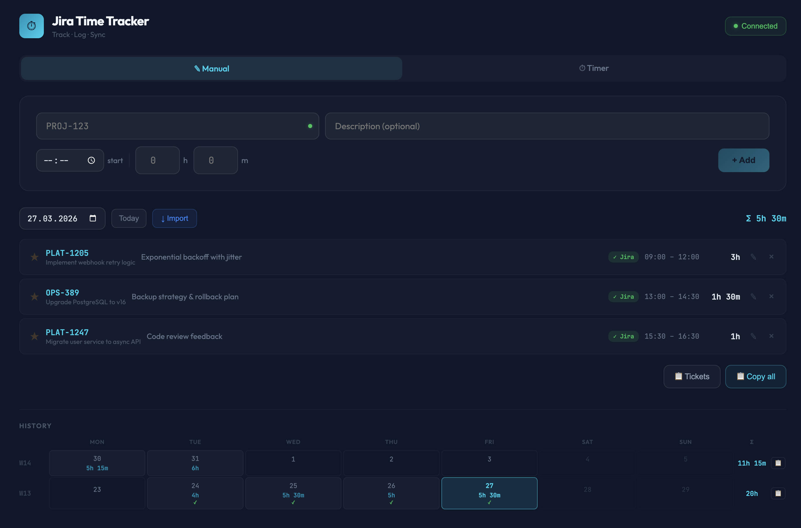

# Jira Time Tracker

Local time tracker for **Jira Server / Data Center** with built-in proxy.

  -orange)



## Quickstart
    
```bash
node server.js https://jira.your-company.com
```

Open `http://localhost:3001`, enter your PAT — done.

## Features

- **Manual entry & timer** — Enter hours/minutes directly (default) or use the stopwatch
- **Editable entries** — Change ticket, description, start time, and duration after creation
- **Manual Jira sync** — Push individual entries or all at once; nothing is sent automatically
- **Import** — Load existing worklogs for a day from Jira
- **Ticket search** — Live search via JQL with issue summary displayed
- **Issue summary** — Jira issue title shown next to ticket key in the entry list
- **Favorites** — Save frequently used tickets with autocomplete
- **Calendar history** — Weekly calendar view grouped by ISO week with hour totals per day and week
- **Copy tickets** — Copy all unique ticket keys for the day as a comma-separated list
- **Copy week** — Export a week's hours as tab-separated decimals (comma separator) for pasting into spreadsheets
- **Start & end time** — Optional start time per entry, end time auto-calculated
- **15-min increments** — Minute spinners step in quarter-hour intervals
- **Sync status** — Visible per entry (Local / ✓ Jira / ✗ Error) with retry; resets on edit
- **Responsive layout** — Adapts padding and card sizes to any window width

## Why a proxy?

Jira Server/DC validates the `Origin` header on write requests (XSRF protection). Browsers set this header automatically and JavaScript cannot override it. Requests from a different origin are rejected with `403 XSRF check failed`.

The built-in proxy solves this: `/rest/*` requests are forwarded server-side to Jira, stripping `Origin`/`Referer` headers and setting XSRF bypass headers.

## Configuration

```bash
# Required: Jira Server URL
node server.js https://jira.your-company.com

# Optional: Port (default: 3001)
node server.js https://jira.your-company.com 8080

# Alternatively via environment variables
JIRA_URL=https://jira.your-company.com PORT=8080 node server.js
```

| Variable | Default | Purpose |
|---|---|---|
| `HOST` | `127.0.0.1` | Interface to listen on. Keep the default unless you know you need network access. |
| `ALLOWED_HOSTS` | – | Comma-separated extra host names the app may be opened under (besides `localhost`, `127.0.0.1`, `[::1]`). |
| `NODE_EXTRA_CA_CERTS` | – | Path to a PEM file with extra trusted CAs. Only needed if the CA isn't in the OS trust store (e.g. Docker) — see [Company CA](#company-ca--self-signed-certificate-in-certificate-chain). |
| `JIRA_INSECURE_TLS` | – | Set to `1` to disable TLS certificate checks (not recommended). |

The proxy only accepts requests sent to an allowed host name by the app itself. Requests from other websites are rejected with `403`. Jira session cookies are kept per PAT, so a request without your PAT never rides on your Jira session.

### Docker

```bash
# Pull and run from GitHub Container Registry (always fetches the latest image)
docker run --pull always -p 127.0.0.1:3001:3001 ghcr.io/chgerkens/jira-time-tracker:main https://jira.your-company.com

# Or build and run locally
docker build -t jira-time-tracker .
docker run -p 127.0.0.1:3001:3001 jira-time-tracker https://jira.your-company.com
```

### Company CA / "self-signed certificate in certificate chain"

The proxy verifies Jira's TLS certificate against Node's built-in CAs **and your operating system's trust store** (Node ≥ 22.15). A company CA that IT has rolled out is picked up automatically — nothing to configure:

| OS | Trust store used | Typical company CA setup |
|---|---|---|
| macOS | System and login Keychain (CA set to "Always Trust") | Installed by device management (MDM) |
| Windows | Trusted Root Certification Authorities (machine and user) | Rolled out via Group Policy |
| Linux | `/etc/ssl/certs` / `/etc/ssl/cert.pem` | `update-ca-certificates` (Debian/Ubuntu) or `update-ca-trust` (Fedora/RHEL) |

On Linux, Chrome and Firefox use their own certificate stores, so a browser may trust Jira while the system store doesn't. Install the CA system-wide, or use `NODE_EXTRA_CA_CERTS` as shown below. The same applies inside WSL.

**Docker** can't see your computer's trust store. Let the image export Jira's CA once, then mount it:

```bash
docker run --rm ghcr.io/chgerkens/jira-time-tracker:main --export-ca https://jira.your-company.com > company-ca.pem

docker run -p 127.0.0.1:3001:3001 \
  -v $PWD/company-ca.pem:/certs/company-ca.pem:ro -e NODE_EXTRA_CA_CERTS=/certs/company-ca.pem \
  ghcr.io/chgerkens/jira-time-tracker:main https://jira.your-company.com
```

`--export-ca` prints the CA's name and SHA-256 fingerprint — compare them with the certificate details your browser shows for Jira. Without Docker it works the same: `node server.js --export-ca https://jira.your-company.com > company-ca.pem`, then start with `NODE_EXTRA_CA_CERTS=$PWD/company-ca.pem`.

### Creating a PAT

1. Open `https://jira.your-company.com/secure/ViewProfile.jspa#!/personal-access-tokens` (or click the link in ⚙️ Settings)
2. Click **Create token**, give it a name, and copy the value
3. Paste it in the app under ⚙️ Settings

> **Note:** PATs require Jira **Data Center** 8.14+. Jira Server (single-node) does not support PATs.

The PAT is stored only in the browser (`localStorage`), not on the server.

## Tests

```bash
npm test            # unit + server tests (no install needed)

npm ci              # once: installs Playwright (dev dependency)
npx playwright install chromium
npm run test:e2e    # browser tests
```

- **Unit tests** (`test/lib.test.js`) cover the date/time helpers in `public/lib.js` across several time zones, including DST switches and ISO week-year boundaries.
- **Server tests** (`test/server.test.js`) start `server.js` in front of a fake Jira server and check the proxy, the request guard, cookie handling and TLS verification.
- **E2E tests** (`e2e/`) drive the app in headless Chromium against a stateful fake Jira: entries, editing, search, favorites, push/update/delete of worklogs, import, timer and the copy buttons. They need internet access to load React and Babel from the CDN.

The app itself still has no runtime dependencies; Playwright is only needed for the e2e tests.

## Project structure

```
jira-time-tracker/
├── server.js          # Node.js server + Jira proxy
├── public/
│   ├── index.html     # Single-file React app
│   └── lib.js         # Pure date/time helpers (shared with the tests)
├── test/              # Unit + server tests (node:test, no dependencies)
├── e2e/               # Browser tests (Playwright) + stateful fake Jira
├── playwright.config.js
├── package.json
├── CLAUDE.md          # Context for Claude Code
└── README.md
```

## Technology

- **Server:** Node.js (0 dependencies)
- **Frontend:** React 18 + Babel (via CDN, no build step)
- **Auth:** Bearer Token (PAT)
- **API:** Jira REST API v2
- **Storage:** Browser localStorage

## License

MIT
